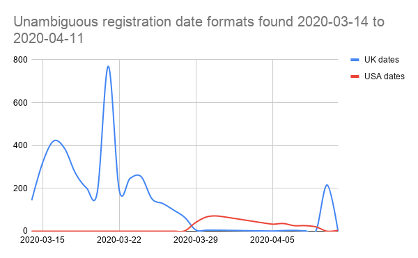

Cleaning up data from volunteer groups across the UK.

# We're only human

In the previous post, we took a tour of the open data available that tells the story of volunteerism across the UK since the coronavirus crisis began.

Since the beginning of the year, thousands of groups have registered, and an order of magnitude more individual volunteers have carried out acts of kindness for people in self-isolation.

Volunteers and organisers are, quite frankly, inspirational. Driven by any number of different value systems, they are helping people for little or no recognition or reward.

Volunteers have provided all the data we’ve seen in the previous article and this, of course, comes with a degree of human error. Cleaning up the registered group information has been challenging for a number of reasons...

The data we are looking at for this article is the combined and cleaned data set collated and shared through [Police Rewired](https://policerewired.org):

* 🌐 [COVID-19 volunteers](https://www.policecoders.org/home/shared/covid-19/communities) (data set, available as GSheet or CSV)

Interested folks have started creating new tools with the data already…

* 📌 A map of the support groups was available through helpisavailable.org.uk (maintained by Police Rewired volunteers).
* 📌 A map [merging this source with data showing areas of deprivation](https://fryford.github.io/coronasupport/index.html) was created by [Rob Fryford](https://twitter.com/fryford) ([ONS](https://www.ons.gov.uk/)), to help guide volunteer and relief efforts.
* 📌 [LocalHelpers](https://localhelpers.org/) offered links to nearby volunteer groups when handling requests or offers of help.
* 📌 The [Community Policing Dashboard](https://www.policerewired.org/home/shared/covid-19/community-policing) was a collaboration between staff and volunteers from ESRI UK and Police Rewired.
* 📌 The COVID-19 combined volunteer groups data set was shared through ESRI’s [Living Atlas](https://www.esriuk.com/en-gb/content/living-atlas), making the information available for other services to build on.

Let’s get started...

## Getting into the data

There were quite a few challenges in getting the data to a state where it’s useful, and I’ll talk about each in turn. I did most of the work using a google sheet and [Google Apps Script](https://developers.google.com/apps-script) (javascript classes bound to Google Drive apps).

If I were doing it all again, I’d work in Python and pandas. Python is easy to pick up, and [Police Rewired](https://policerewired.org/) have documented and shared some good resources for learning it from the [NSA staff training course](https://www.policerewired.org/home/nsa-python-study-group).

So where are the biggest issues?

### Dates are a mess

Since the dawn of computing, times and dates have been recognised as a major pain-point for developers. There are many local preferences for writing dates. We see two formats used in the data from Covid Mutual Aid UK, both of which are problematic because many dates in either format could be interpreted ambiguously:

* 📆 `dd/mm/yyyy` (as in the UK)
* 📆 `mm/dd/yyyy` (as in the USA)

[ISO-8601](https://en.wikipedia.org/wiki/ISO_8601) (the unabiguous `yyyy-mm-dd` date format) aims to undo a lot of this damage, but many systems today still revert to local, ambiguous or incompatible formats.

Covid Mutual Aid UK initially started recording their dates in the UK format, however towards the end of March switched to the US format. Determining the date of this switch has been a key challenge in extracting meaning data for the registration graphs.

It is possible to extract some meaningful information about the dates we have, using some quick logic and a couple of assumptions:

* Dates are provided in only UK or US format.
* Dates are recorded in a field called ‘Created’ suggesting that this is the time of registration. _Records can never be submitted with a future date._
* Dates are recorded one way before a certain date and another way afterwards. The registration system isn’t generating a mix of both.

The process applied (and shown below) would not have been anywhere near as simple without the kind help of a good friend called Sam. The _no future dates_ constraint is far more helpful than I had assumed!

Having completed our initial round of interpretation, only a few hundred dates remain ambiguous. Good enough! We can now plot the unambiguous data we have…

NB. the spike in UK format dates on the right comes from local council hubs data imported on 10th April. Remove that, and it’s pretty clear that the switch-over to US date format happens around 28th March.

This means we can interpret every date after the 28th as a US date, including the 4 days of ambiguous dates found in the first pass (1st to 4th April), giving us a near-complete set of unambiguous dates.

### Updates and duplicates look like registrations

Entries in the Covid Mutual Aid UK data set are not all about new groups. Some are updates to previously entered records, and some are simply duplicates as different volunteers enter the same information.

Detecting duplicates and updates isn’t trivial. A good approach is to identify a set of key values that define an entry. In our case, we can consider this triplet to represent a unique group:

1. Location
1. Group title
1. URL

Using our domain knowledge, we can say it’s safe to assume that any new entry with this triplet that already matches another in the data set is a duplicate.

We can go further, applying what we know about groups, and say that any entry with 2 out of the 3 is probably an update:

* 🔧 Any entry with matching location and title, but a different URL, have submitted a correction to their URL.
* 🔧 Any entry with matching location and URL, but a different title, have submitted a correction to their title.

Or another entry entirely:

* 🔧 Any entry with matching title and URL, but a different location is another instance the same group operating in another area, so can be treated as a new entry.

Using these rules we can compare new entries against the existing data set, and then determine whether they represent a new piece of information or an update to an old record.

### Addresses vary wildly for the same place

There are so many different ways to describe a location, and addresses are really only a very loosely defined way of doing it. So how can we spot when two people mean the same place, but have written it differently?

> 📌 “100–104, The High Street, Townsville” and 📌 “The Old Post, High Street, Townsville” might not seem easily comparable. Now mix in some post codes, start to reorder parts of the address, remove the street name, and add a few typos…

This is a huge problem, and not one easily solved by a lone data scientist with a spreadsheet. _(I guess I’m a data scientist now?)_

However, as the data is going to be plotted on a map, an answer presents itself. We will need to [geocode](https://en.wikipedia.org/wiki/Geocoding) the provided address to get a latitude and longitude for each group.

Geocoders (such as the Google Maps Geocoding API) must resolve addresses to points on a map every day, and as they do so they quantise their results to the positions of real buildings and landmarks. By first geocoding, and then comparing the resulting coordinates, we can pass the language problem over to an organisation with resources to resolve and match addresses in almost any form they are presented.

### URLs are not very easy to copy

It’s an assumption that instructions like “copy and paste the URL of your group here” are easy to follow. A significant number of records suffer from misunderstandings and do not resolve to valid URLs. Some came close, though…

Helping get those nearly-correct URLs over the line was the subject of some effort. There are some easily recognised mistakes that can be automatically fixed:

* 🔧 URLs starting with `http:/`, `http//`, `https:/`, `https//` can be easily amended to `http://` and `https://` (respectively).
* 🔧 URLs that do not start with a protocol can be prefixed with `https://` (which works for nearly everything these days).
* 🔧 URLs from the most common social media platforms are not case sensitive, so all URLs can be lower-cased for comparison.

A high proportion of the results have been copied directly from the address bar of a browser. That’s really the simplest way, and it’s not reasonable to expect people to have a full understanding of what they’ve copied… As a result, nearly all URLs can have their query-string (that’s all the garbage you see past the ‘?’ in some links) removed. Most common social media platforms use restful URLs, and so the query-string is rarely important. (This helps with matching, too, as query-strings often vary, and so would prevent a duplicate URL from being spotted.)

Some people don’t really understand what is being asked of them, and copy the wrong URL. Plenty of people copied the Covid-19 Mutual Aid UK website URL into their form, others facebook.com, and others had clearly submitted a search (complete with parameters) rather than a direct link.

In each case, these can be detected and flagged as less-than-useful.

Other links were broken in other ways that couldn’t be easily fixed. Every link in our data source was checked to see if it resolved to a web page of some sort. The ones that didn’t were then marked up as HTTP errors (with their error code).

### Are all the links really for volunteer groups?

Having run these processes what we are left with is almost a clean data set. There are just a few other wrinkles to iron out, and for this we need to understand a little bit more about the data itself.

In the previous post, we explored the URLs provided for each volunteer group — matching on aspects of them to determine which tools they represented.

A group of links worth filtering through manually are the organisations that appear on facebook (perhaps churches, schools, community centres, etc.) — many of which will be legitimately taking part in local volunteering efforts.

Some facebook links, however, may have been miscategorised or listed by opportunists hoping to raise the profile of their personal or business accounts.

Facebook links have some clues that help us to identify whether they point to a group, and by and large the groups are likely to be appropriately listed.

But what about individuals and organisations? After filtering these out for manual intervention, there were about 400 ambiguous links — and this is a manageable subset to explore by hand. I did it myself in an evening, examining and visiting links for signs that they are:

* Obviously a volunteer or support group (accepted).
* An individual account (warranting a little extra attention).
* An organisation (checked to ensure they’re involved in support).

## So ends our story

So that’s the story of the data and how it was cleaned.

It’s been a really helpful exercise for me to learn about the data and develop some of these processes. I know I’ve been lucky: The data set is of the perfect size to learn from and reason about without overwhelming me. I was able to quickly identify many (although not all) of the edge cases where unusual links or data was being provided. For the fixes I couldn’t automate, it was possible to reduce the set to a manageable size and inspect the data manually.

I hope it’s been useful and helpful for you too. 👍

The data is available for you to play with, and I’d love to know if you build anything with it. I’m reachable on Twitter as [instantiator](https://twitter.com/instantiator).

* 🌐 [COVID-19 volunteers](https://www.policecoders.org/home/shared/covid-19/communities) (data set, available as GSheet or CSV)

## Police Rewired

[Police Rewired](https://policerewired.org) is a group for volunteer professionals, students, academics, developers, designers, and creative problem-solvers who want to develop tools and work on projects in public safety and crime.

If you’d like to take part, or you’re already working on a voluntary project in public safety, we’d love to hear from you!

