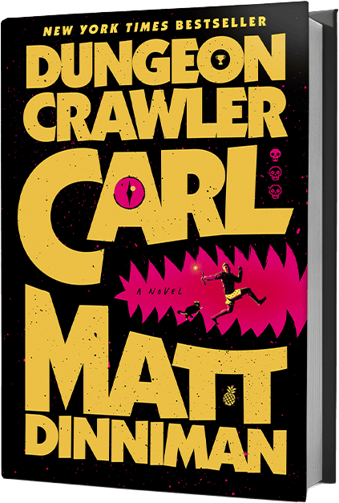
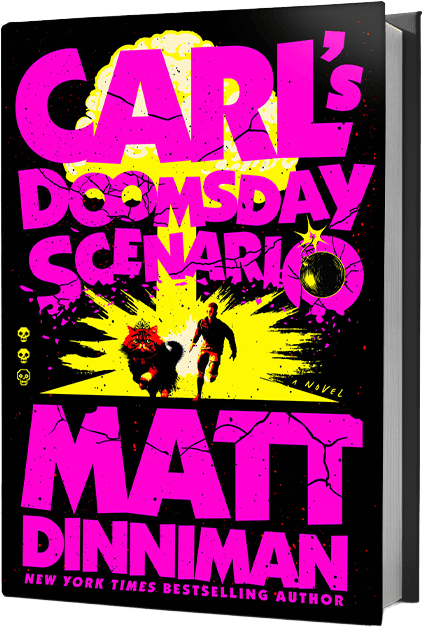
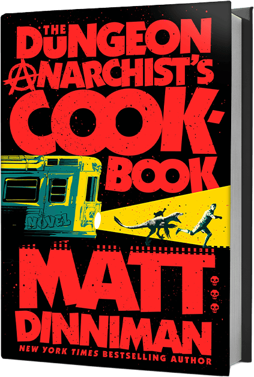
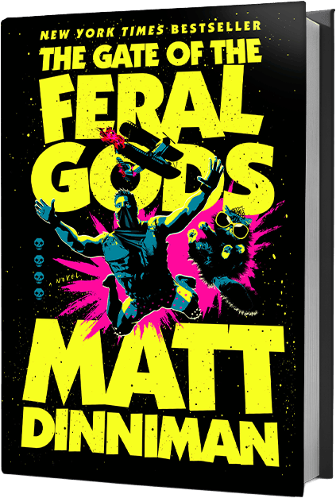
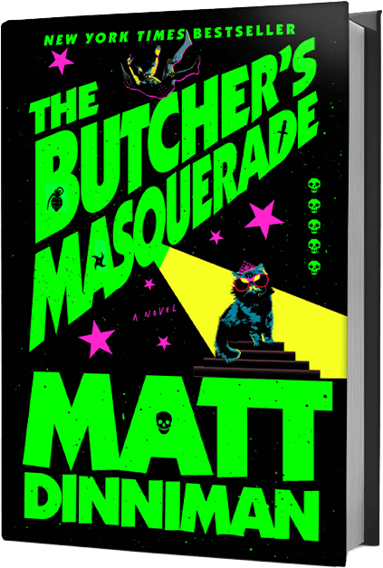
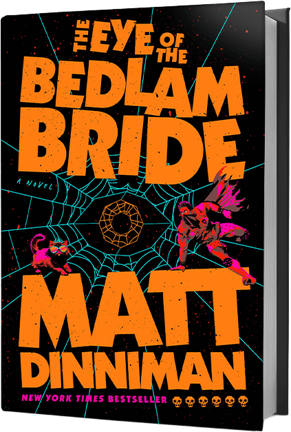
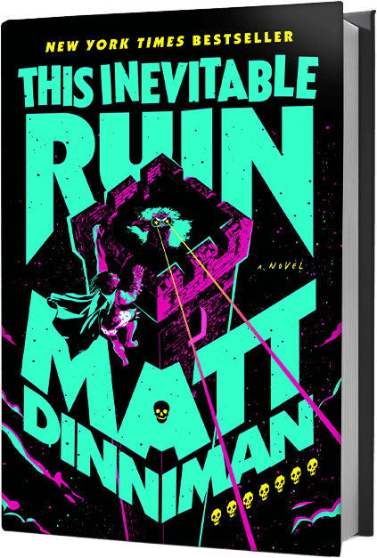
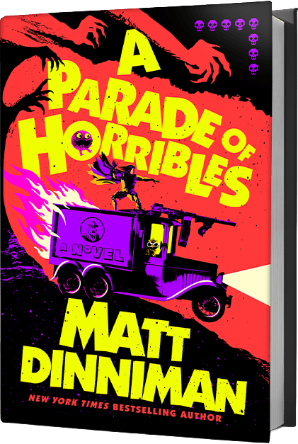

_TLDR: I'm enjoying Dungeon Crawler Carl. It's amusing and poignant. It has several themes, they're layered, and it takes a while for them all to warm up._

# Dungeon Crawler Carl

I've been reading a lot of good books recently, and I'd been avoiding [Dungeon Crawler Carl](https://mattdinniman.com/books/dungeon-crawler-carl/) for a while... The title and cover appealed to one part of me, but it felt like there was a real risk that this was going to be a "gosh aren't I zany" book from an author who might self-describe as "the new Terry Pratchett". (There are far too many of those!)

**Matt Diniman** did not do this, and Dungeon Crawler Carl is a much richer read than I first expected.

This review wouldn't really be complete without noting that the audio books are a joy. **Jeff Hays'** versatility is something to behold. His delivery enhances the humour and it really was only by the third book that I realised just how many of the voices were his.

|  |  |  |  |  |  |  |  |
|-|-|-|-|-|-|-|-|

Dungeon Crawler Carl is a series of books. At time of writing there are 8, but Matt has said that he hopes to have completed books 9 and 10 (finishing the series) before the recently-commissioned TV adaptation gets started.

The books are at times a joyful and amusing homage to dungeon crawler games, at others heartfelt explorations of loss and the complexities of living with (or without) the disappointment of imperfect families. The characters are warm, and I found myself caring about what happens to them.

> A good measure of a book's success, for me: Is there a thriving community of fans creating fan art, speculating about the stories, and sharing their own ideas? [r/DungeonCrawlerCarl](https://www.reddit.com/r/DungeonCrawlerCarl/) and [r/UnexpectedDCC](https://www.reddit.com/r/unexpecteddcc/) have all of these.

Without giving too much away, the first book kicks off with an alien intervention that (largely) destroys the world, leaving the survivors a choice: Fight their way through a themed dungeon full of monsters, or struggle on the planet's ruined surface. Carl enters the dungeon with his ex-girlfriend's show-cat, Princess Donut.

Initially, it really is a light-hearted dungeon crawl, as advertised. There's a bit of gore, and there are game mechanics. This may not seem like a particularly rich theme: Carl fights monsters, and gets rewarded for it. For many, that will feel like a pretty standard trope, and not really enough for a series of books - so it's worth knowing that things develop. Carl and Donut have rich histories, and so do their friends and associates in the dungeon.

Even in the first book, the groundwork is laid for a wider story. Hints at what's going on, why the dungeon is the way it is, and what's really at stake may not stand out until you've delved a little deeper and met some more of the key characters.

The dungeon isn't static, and each new level changes the stakes and the rules. Figuring out why it is the way it is, why they're doing what they do, and grappling with the ethical conundrums the dungeon creates, are a large part of what makes these books fun. How "the good guys" figure out exploits, break the game, and the consequences of their actions keep the stakes high.

That said, some of the situations they find themselves in do seem a little overcomplicated at times. Book 3 introduces some important themes, widens our view of the geopolitical story playing out both inside and outside the solar system, and is also built around a complicated set-up. There are reasons it is the way it is, and Matt is definitely aware it's complicated, but it certainly made things hard to follow at times. Knowing that it's all for a reason, and trusting that it would all fit together in the end, helped me - but your mileage may vary. The story still advances, and it's pretty clear there are no "filler episodes".

I've been recommending Dungeon Crawler Carl to friends because I'm having a good time with it. I appreciate that if the early grind feels boring or derivative, you may not have the energy to keep going. For those that do, there are lovable new characters and a wide story arc set in a universe that has real (awful) reasons for doing what it does... 

_Matt's on to something._

**Strengths:**

- Amusing, heart-felt, lovable characters
- Rich story, wider than just a dungeon crawl
- Quotable on bumper stickers

**Weaknesses:**

- Game mechanics aren't for everyone
- Occasionally overcomplicated
- Room for more story depth in the first book
