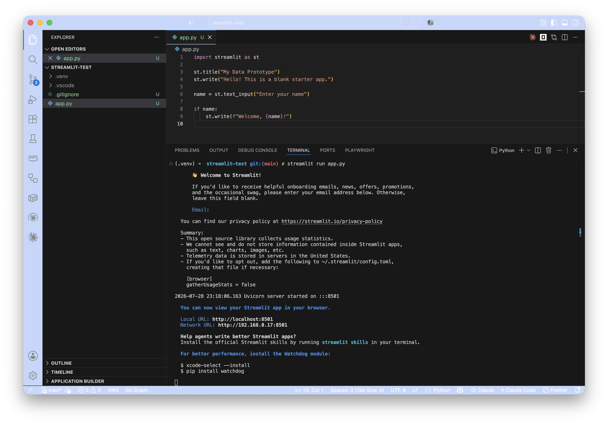
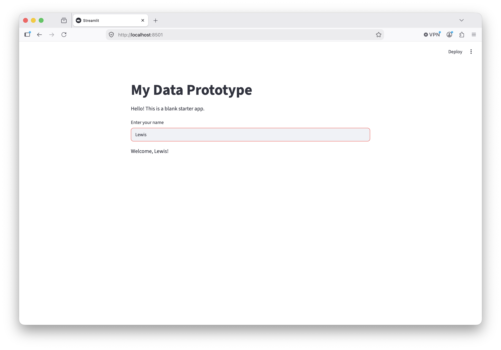

In earlier posts we set up a dev environment and a Git repository. Now we'll create a small prototype from scratch using [Streamlit](https://streamlit.io).

## Why Streamlit?

> It's worth talking about Python for a moment. It's a popular choice for data science work.
> 
> I've worked in software development for a long time, but I'm not a Python expert. Like every language, it has strengths and weaknesses.
> 
> For data science, in particular, there are some versatile Python libraries that make it easy to manipulate and analyse large datasets. Because these libraries are popular, it helps data scientists and analysts to collaborate. Everybody speaks the same language.
> 
> - `Pandas` is a library for working with datasets, managing tables of data as `DataFrames`
> - `NumPy` is a library for performing operations on large amounts of data very efficiently
>
> For an introduction to both, see: [Introduction to Pandas and NumPy](https://www.codecademy.com/article/introduction-to-numpy-and-pandas) (codecademy)


**[Streamlit](https://streamlit.io)** is an open-source Python framework for building web apps. It is:

- **Simple** — you can just write plain Python, you don't need other languages like HTML, CSS, or javasript
- **Popular** — there's a large user community
- **Well maintained** — it's actively developed by a dedicated team and has open-source contributors
- **Well documented** —  there are plenty of guides and tutorials for working with Streamlit
- **Fast to build with** — you can create a running app very quickly

Streamlit lets you build interactive web pages, linked to code that runs data processing, with very little effort. That makes it ideal for prototyping.

Read more:

- [Streamlit documentation](https://docs.streamlit.io/)

## Prerequisites

In the previous tutorials, we set up your working environment. Please make sure you have:

- installed VS Code
- installed git
- cloned your repository and opened it in VS Code

### Installing Python

Streamlit needs Python 3.8 or later. Check if you have it installed with:

```bash
python3 --version
```

<details>
<summary> <b>Mac OS...</b> </summary>

macOS often comes with Python 3 pre-installed. If not, if you have Homebrew installed, you can install Python with:

```bash
brew install python
```

If not, you can download the installer from [python.org](https://www.python.org/downloads/).
</details>

<details>
<summary> <b>Windows...</b> </summary>

Download and install Python from [python.org](https://www.python.org/downloads/). Remember to choose **"Add Python to PATH"** during installation.
</details>

<details>
<summary> <b>Linux...</b> </summary>

Use one of these commands, depending on your system:

```bash
sudo apt install python3 python3-pip python3-venv    # Debian / Ubuntu
sudo dnf install python3 python3-pip python3-venv    # Fedora
```
</details>

## Creating a simple prototype

Open your project directory in VS Code, and then open a new terminal. This terminal will start in the project folder.

### 1. Create a virtual environment

A virtual environment keeps your project's Python packages isolated from the rest of your system. Packages are libraries and tools, and it's good to keep each project separate so that if you need a specific version of a package for a particular project, that won't interfere with or break another project.

If you are not currently in the project folder in your terminal (you should be if it's a new terminal), you can move to it with:

```bash
cd ~/src/my-project
```

Now create the virtual environment:

```bash
python3 -m venv .venv
```

Next, activate the environment.

For Mac OS / Linux:

```bash
source .venv/bin/activate
```

For Windows:

```bat
.venv\Scripts\activate
```

You'll know it's active because your terminal prompt will show `(.venv)` at the start.

### 2. Install Streamlit

```bash
pip install streamlit
```

> [pip](https://en.wikipedia.org/wiki/Pip_(package_manager)) is the Python package manager, and the word `pip` itself stands for "pip installs packages". That's a recursive acronym, and... you're going to have to get used to them! They're everywhere in software development.

This installs Streamlit and its dependencies into your virtual environment.

| Package | What it does |
| --- | --- |
| `streamlit` | The framework itself — handles the web UI and reruns your script on interaction |
| `pandas` | Data manipulation library — Streamlit uses this internally, and you'll use it for data work |
| `numpy` | Numerical computing — a dependency of many data science libraries |
| `plotly` / `altair` | Charting libraries — used for nice, interactive visualisations |

You can see everything that was installed by running:

```bash
pip list
```

### 3. Create the application file

Create a new file called `app.py` in the root of your repository with this content:

```python
import streamlit as st

st.title("My Data Prototype")
st.write("Hello! This is a blank starter app.")

name = st.text_input("Enter your name")

if name:
    st.write(f"Welcome, {name}!")
```

That's it — you have a working Streamlit app right there.

#### Working through the example...

It's a pretty simple application, but let's work through it line by line to see what it's doing.

Streamlit allows you to define everything that's shown to the user with simple calls to functions that it provides.

<table>
<tr><th>Python</th><th>What it does</th></tr>

<tr>
<td>

```python
import streamlit as st
```

</td>
<td>
  This tells the application to use the `streamlit` package from the virtual environment, and to refer to it as `st` (making your code a little more concise!)

  Everywhere you write `st.function_name` in later lines, you're referring to functions provided by the `streamlit` package.
</td>
</tr>

<tr>
<td>

```python
st.title("My Data Prototype")
```

</td>
<td>
  Sets the title of the page to "My Data Prototype" by calling the `streamlit.title` function with a single argument: the new title of the page.
</td>
</tr>

<tr>
<td>

```python
st.write("Hello! This is a blank starter app.")
```

</td>
<td>
  Prints some wording to the page for the user to read, by calling the `streamlit.write` function with a single argument: the wording to display.

  > Hello! This is a blank starter app.
</td>
</tr>

<tr>
<td>

```python
name = st.text_input("Enter your name")
```

</td>
<td>
  Calls the `streamlit.text_input` function to shows a simple prompt for the user to fill in with text. Here the single argument is the text to show the user, relating to the prompt:
  
  > Enter your name

  When the user enters a value, this is put into the `name` variable, which is used in subsequent lines.

  On first run, the `name` variable is empty.
</td>
</tr>

<tr>
<td>

```python
if name:
    st.write(f"Welcome, {name}!")
```

</td>
<td>
  This is a call to the `streamlit.write` function again, but it's in a block that's governed by an `if` statement, which tests the  `name` variable.

  Here's why:

  - Before the user has provided a value for `name`, there's nothing in it (Python calls this `None`) - so showing `"Welcome, {name}!"` on the page would actually show:

    > Welcome, !

  - To avoid this, we've used an `if`-statement. - The call to `st.write` only happens if there's a value for `name`.
  - For a block in an `if`-statement to run, the test must evaluate to `True`. Because an empty variable does not evaluate to `True`, the block doesn't run - and `st.write` is not called.
  - If the user has provided anything in the `name` variable, _then_ the test will evaluate to `True`, the block will be run, and the `write` function will be called.
  
    eg. with `Lewis` in `name`:

    > Welcome, Lewis!
</td>
</tr>

</table>

There's plenty more to learn about Streamlit, but for now, it's helpful to understand what it's doing at a basic level.

### What if the user changes the name they provide?

When an input changes, Streamlit re-runs the application from the start. This means that the new value for `name` is picked up on the line that assigns it:

```python
name = st.text_input("Enter your name")
```

That new value then evalutes to `True` in the `if`-statement, the block runs, and the UI shows the welcome message.

### 4. Run the application

```bash
streamlit run app.py
```

A new tab will open in your browser showing your app at `http://localhost:8501`. (Streamlit will use port `8501` by default, but you can change that if you need.) Any changes you save to `app.py` will automatically be refreshed in the browser.

| VS Code | Your application |
|-|-|
|  |  |

### 5. Stop the application

Go back to the terminal where the app is running and press `Ctrl+C`. The app will stop.

## Excluding the virtual environment from Git

Your `.venv` folder contains thousands of files that Git shouldn't track. Whenever anybody else uses your project, they can initialise their own virtual environment, and this means you won't end up paying to store volumes of open source code in your git repository that anybody could retrieve for themselves.

Create a `.gitignore` file to exclude it.

You could create the file yourself, with a single line in it:

```
.venv/
```

or you could use a simple command in the terminal to create it:

```bash
echo ".venv/" > .gitignore
```

## Making your first commit

Ok - you've created a simple Streamlit app, and we're ready to push it to your repository for safe-keeping. For now, we'll work on the `main` branch - it's just you working on the project, and this means you don't need to perform branch-gymnastics just to add some basic code.

In the terminal, type (or copy/paste) each of these lines, and review their output.

Add all _changed_ files to **staging**. Staging contains files under consideration for the next **commit**:

```bash
git add .
```

Create a new **commit**, with a commit message, composed from all the changes in **staging** right now:

```bash
git commit -m "Add a simple Streamlit data prototype"
```

Push all new commits from your local repository to the remote:

```bash
git push
```

> NB. If this is the first time you've pushed to a remote repository, git may ask you to set up tracking between your local branch and the remote equivalent. You'll see a prompt inviting you to use a variant of the `push` command. Because we're working with the `main` branch, it might look like this:
>
> ```bash
> git push --set-upstream origin main
> ```

Reload the page for your repository on GitHub, and you should see `app.py` and `.gitignore` have been added. (By default, GitHub will show you the `main` branch of your repository.)

## What, no AI?

You're absolutely right, buddy! We've gone 2 whole tutorials without using the AI coding assistant you set up in the first tutorial. That's intentional.

Once you're familiar with the core tools, it'll be much easier to give an AI assistant clear directions, and to review the code it creates. It's important to have an idea about what you're making so you can be responsible for it.

### This is your code, and you are responsible for it

AI coding assistants are great but, just like people, they can make mistakes. They may not understand your intent, or they may write code that seems to work but fails in unexpected ways. It's important to be sure that new code really does what it's supposed to do before it goes into the project.

In future tutorials we'll look at how to write automated tests that prove your code does what it's supposed to do.

### Learning Python

There are plenty of [Python tutorials](https://www.google.com/search?q=python+tutorial) available, and I recommend that as a part of continuing with this tutorial series, you find one that works for you.

## Some helpful commands

| Step | Command |
| --- | --- |
| Create virtual environment | `python3 -m venv .venv` |
| Activate it | `source .venv/bin/activate` |
| Install Streamlit | `pip install streamlit` |
| Run the app | `streamlit run app.py` (stop with `Ctrl`+`C`) |
| Add, commit, and push | `git add .`, `git commit -m "..."`, `git push` |

## Summary

You now have a running, version-controlled prototype.

### Coming up...

In future tutorials, we'll start working with an AI assistant to:

- add some simple logic, and automated tests to prove that your code does the right thing
- add the exciting features: data processing logic, visualisations, and interactivity

We'll also be:

- documenting your code, as you go, to help others
- thinking about how to break your work into manageable tasks
- thinking about how to protect user data

### My biggest recommendation

**Don't start working with real data about _people_ until you're sure you've got a good handle on what your responsibilities are, and how you'll keep that data safe.** We'll explore those topics together in future tutorials.