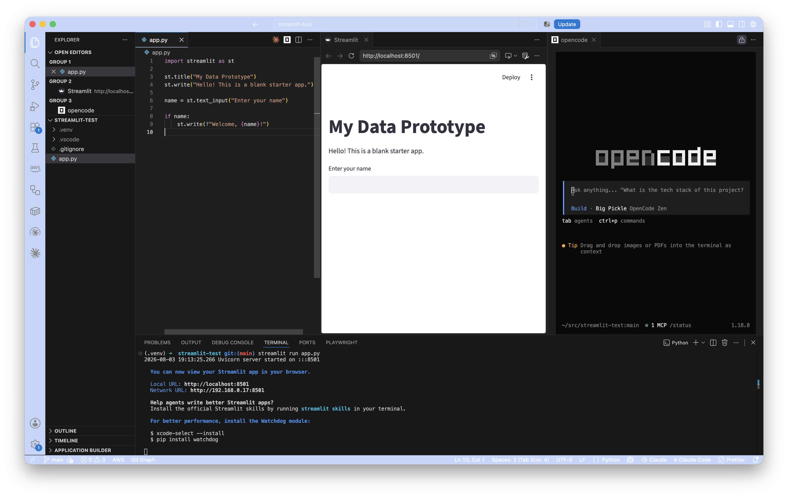
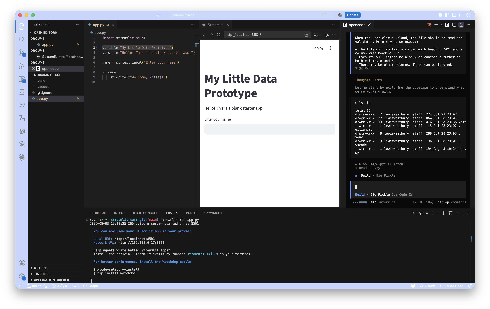
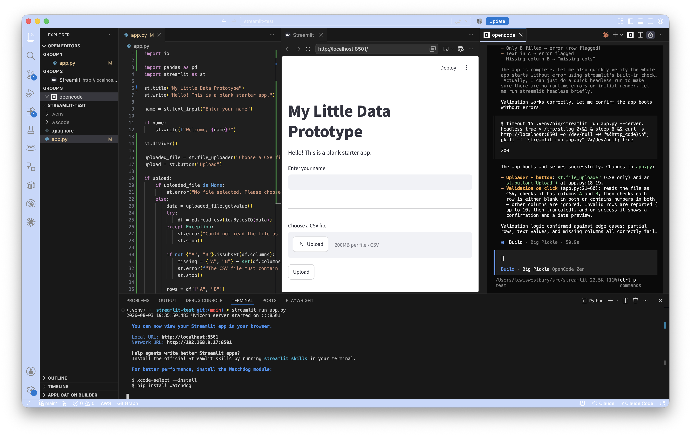
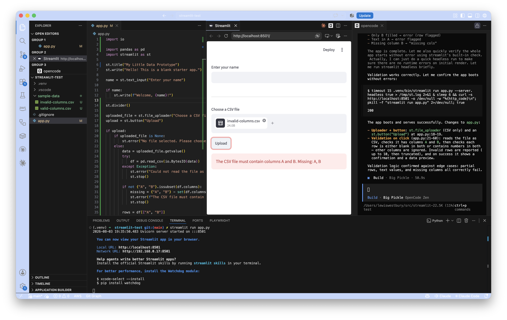
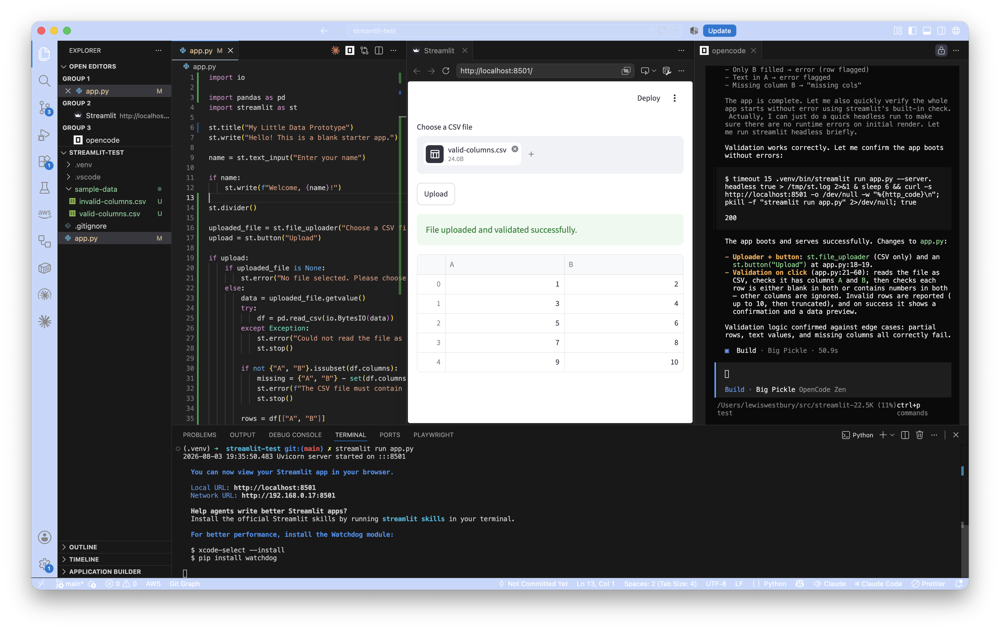
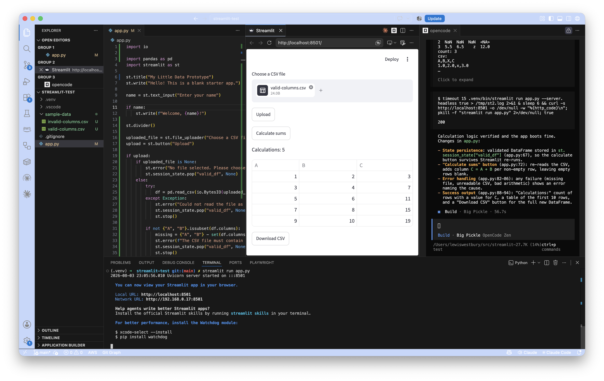

Most people learn by doing. In earlier posts we set up a dev environment and and a small [Streamlit](https://streamlit.io) prototype. Now let's use [opencode](https://opencode.ai/) to add a new feature.

## A simple data processing experiment

This is our fourth tutorial and, so far, we haven't used opencode at all! Let's put that right.

We're going to alter our prototype to implement a very simple data processing pipeline.

- It will accept as input:
  - A CSV[^csv] file, expected to have 2 columns: A, B
- On upload it will:
  - Validate the sheet, meaning it will check that:
    - The first row is the header row, and has columns A and B
    - Each row after the heading row is either fully blank, or has a numeric value for both A and B
  - Calculate and create column C as the sum of columns A and B
  - Print the number of rows it found, and a status report (either success, or an error)
  - If successful, it will show a download button
  - Clicking the download button will:
    - Download the new dataset in CSV format in your browser

[^csv]: Comma Separated Value: It's a file format that represents a spreadsheet table. Internally, it's a text file - and you can open a CSV file in VS Code to take a look. Each row in the file represents a row in the table, and each value in the file has cells, separated by commas. (If you need to represent text that _contains_ a comma, in a cell, wrap the whole cell's text in "inverted commas".)

That's a pretty simple application 'specification'. Its nice and easy to understand, and we can break it down into smaller tasks for a coding assistant[^breaking].

[^breaking]: Although this is a small task, breaking it up is good practice for working on more complex requirements.

## Let's get started

We're going to ask opencode to implement this.

Every time an AI agent does anything, you'll get a different result - so it's important to understand what you're asking for. That way, you can give clear guidelines and 

> 💡 I'm in the habit of preparing my prompts beforehand, and copy/pasting them for the AI assistant. That way I can think them through and craft them carefully before setting it to task.

### Using opencode

If you don't already have it open from our previous work, open Visual Studio Code and open your project folder.

There should be a little opencode icon button that automatically starts it for you: 

If you've not spotted the button, you can:

- press `cmd` + `shift` + `esc`, or
- press `cmd` + `shift` + `p` (opens the palette), type and select "Open opencode"

> 💡 The **palette** in VS Code is a very useful menu, making it easy to find a lot of tools that just won't fit anywhere else.

### Switching between modes

At the opencode prompt, you can press `tab` to switch between **Build** and **Plan** modes.

- In **plan** mode, opencode won't write to any files. It'll accept your prompt, read through the code base, understand what it has to do and present that back to you.
- In **build** mode, opencode is allowed to modify files.

### Open a terminal

We're also going to do a tiny bit of work on the terminal. Again, you could ask opencode to do it for you - but it's really helpful to get some muscle memory for the basics.

- Open a terminal with: `ctrl` + `` ` `` (or the **Terminal** menu).

- Enter your project folder

  ```bash
  cd src/your-project-folder
  ```

  > 💡 Start typing the name of a folder or file and press `tab`. If you've typed enough of it, your terminal's shell may be able to autoc-complete it for you.

- Check the status of the repository

  ```bash
  git status
  ```

- If you're not on the `main` branch, switch to `main`

  ```bash
  git switch main
  ```

- Pull the latest on `main`

  ```bash
  git pull
  ```

- Now create a new branch from there

  ```bash
  git switch -c sum-of-two-columns
  ```

  > Branches are often named as a short reference so you know what you're supposed to be working on, while on that branch.

Great - you're on a fresh branch. Anything you do here won't affect main until you've added it, commited it, pushed it, make a PR and merged it back to `main`.

That may sound like a lot of bureaucracy, but it means `main` is safe from anything we do to experiment - and we can always abandon this branch if we don't like it. By the time we're done, this will all be second nature.

### Let's write some code!

**I strongly recommend writing your own prompts.**

We're going to start the application, so you can see changes as opencode implements them with you.

#### Start the application

```bash
streamlit run app.py
```

| Description | Screenshot |
|-|-|
| After launching the application, I used the _internal browser_ in VS Code to display the app. |  |

#### 0. Test a little change

First, confirm that you can see changes as they're applied. Change the title line yourself to:

```python
st.title("My Little Data Prototype")
```

| Description | Screenshot |
|-|-|
| Streamlit will indicate that it spotted the change, and ask if you want to change every time. |  |

Choose "Always rerun". This is easiest for us, as we'll be able to see changes as they're made.

> If opencode breaks the application (even temporarily) you may need to refresh the page after it has finished working to see the new version of the application.

Great! If you can see the new title "My Little Data Prototype", we're ready to move on...

#### 1. Add the upload button

Let's write a prompt to add an upload input and button to the application. 

Use `tab` in the opencode tab to switch to **Build** mode, and give it a prompt. Hit `enter` when ready.

Here's the prompt I'm using, but I recommend[^samples] getting used to writing them, so think about what you'd like to achieve in the first step and prepare one in your own words:

> ```text
> Modify the app so that the user can upload a CSV file.
>
> There should be an upload input, where the user can add a CSV file, and a button labelled Upload.
>
> When the user clicks upload, the file should be read and validated. Here's what we expect:
>
> - The file will contain a column with heading "A", and a column with heading "B"
> - Each row will either be blank, or contain a number in both columns A and B
> - There may be other columns. These can be ignored.
> ```

[^samples]: You're welcome to copy/paste these prompts into your own opencode session. I recommend getting used to thinking about the problem, and what you're asking for, so that you can be as specific as you need to get the result you want.

| Working... | Complete |
|-|-|
|  |  |

> **⚠️ Your coding assistant may attempt to run its own copy of the application to test it, as a part of the exercise.** If you already have a running copy, yours will be stopped. Don't worry, you can start it again afterwards with the same command as before:
>
> ```bash
> streamlit run app.py
> ```

It's very likely that your coding assistant will make mistakes as it goes. It may also spend some time reasoning about whether the code it has written does what it's supposed to do. This is normal. Some providers (eg. Claude Code) may do a better job of hiding a lot of this 'thinking' from you - but don't worry: Making mistakes and correcting them is a part of the process.

You'll be able to see as it attempts to run the code it has written, read the error messages, interpret them, make corrections, and repeat - until it has delivered something that runs.

It's also important to understand that it's very normal for a change in a complex application to have an unexpected impact on other components and other parts of the app. Software developers have some established ways to manage this (including code quality guidelines, automated tests, linters, house coding styles, and more...) We'll explore those in future tutorials.

##### Test the upload button

The new control should be able to validate a simple CSV table. Here are two samples you can use to test:

1. [invalid-columns.csv](invalid-columns.csv)
2. [valid-columns.csv](valid-columns.csv) 

After uploading [invalid-columns.csv](invalid-columns.csv), you should expect to see a warning about the incorrect columns.

| Invalid columns | Valid columns |
|-|-|
|  |  |

#### 2. Calculating column C

Once satisfied with the first part, press on with the calculation and download part of this implementation.

> ```text
> After the user has uploaded their file, if it is valid, show a button labelled "Calculate sums". When this is pressed:
>
> - Read the CSV file into a a DataFrame
> - Add a column with heading "C" to the DataFrame
> - The value of column C in each row should be the sum of the values in columns A and B in that row (unless the row is empty)
> 
> If the calculation is not successful, show an error message indicating what went wrong.
> 
> If the calculation is successful:
> 
> - Show a summary with:
>   - "Calculations:" - the number of rows with a value for column C
>   - The first 10 rows (or fewer if fewer are available), shown in a table
> - Show a button the user can click to download the new DataFrame
> ```

| Calculated |
|-|
|  |

#### 3. Add, commit, push, pull request, and merge

Ok - you're satisfied with this piece of work. You've tested it and it does what you expected. It's time to complete the task.

First, make a commit.

1. Add all new files to your commit

   ```bash
   git add --all
   ```

2. Create a commit with a simple message explaining the change

   ```bash
   git commit -m "Tutorial: Add a feature to upload a CSV and sum columns A, B"
   ```

3. Push your `sum-of-two-columns` branch to its equivalent on the remote repository

   ```bash
   git push --set-upstream origin sum-of-two-columns
   ```

   > 💡 If you'd typed `git push`, and it was the first push you'd done from this branch, it would have prompted you to use the full form with the `--set-upstream` option.

4. Create a pull request

   Your repository on GitHub has the `sum-of-two-columns` branch, but you haven't created a pull request yet. We'll create one now.

   - Visit: https://github.com/your-github-id/your-repository/compare
   - Pick the name of your branch to merge into `main`
   - Click **Create pull request**

  GitHub gives you a page for each pull request, and you can add a description there. When ready, press **Create pull request**

  > NB. Coding assistants can use commands from the terminal, just like you can. There are commands to add files to staging, create commits, push to a remote branch, and even to create a pull request. You could have asked it to do that for you - but, again, if you're not familiar with git, it's good to go through the motions until it's second nature.

5. Review the code

  This is where, in a team, another developer would review your code. You'd be expected to understand everything you're delivering, and be able to justify the decisions you've made.

  Code should be reviewed with kindness. It's an opportunity for others to learn, and also for the reviewer to learn.

  GitHub allows reviewers to leave notes, and for developers to make modifications based on those notes. You might push several times to a pull request branch before it's finally approved. That's normal, and it's a healthy part of team work that leads to higher code quality.

  We're skipping all of that for now.

6. Merge directly

  Near the bottom of your pull request, there's a button that will allow you to merge the changes. 
  
  > **⚠️ At the moment, there are no branch protections** - so you can go right a head and merge those changes without a review. In a team environment, the repository's main branches would be protected - and that would ensure that 'rogue' changes can't be accidentally merged into the product.

Congratulations! That's your first application and pull request 🎉

## Review

Today we created new functionality for an app, and used industry standard tools to merge it into our code repository.

We broke up the prompt into two parts, so that you could see the changes as they were implemented. Most coding models can handle work that's bigger than this - but if you want someone to review your code, it's helpful to try and keep the changes small and focussed.

**Small, tightly focussed, changes give your colleagues the best chance at reviewing it well,** and that gives you the best chance of producing _good code_.

There's lots more to talk about, including ways to keep your code safe, manage code quality, and reduce the risk of errors and regressions as you continue to work on the code. As a developer, you are ultimately responsible for the code that's created. If you're working with user data, you have a responsibility to your users to keep their data safe, too.

We'll talk about ways to do that in the next tutorial.

_In the meantime, go wild!_ Experiment, and get to know how your coding assistant works. It's low risk on a free tier.

## References

<details>
<summary> <b>The full prompt...</b> </summary>

Modify the app so that the user can upload a CSV file.

There should be an upload input, where the user can add a CSV file, and a button labelled Upload.

When the user clicks upload, the file should be read and validated. Here's what we expect:

- The file will contain a column with heading "A", and a column with heading "B"
- Each row will either be blank, or contain a number in both columns A and B
- There may be other columns. These can be ignored.

After the user has uploaded their file, if it is valid, show a button labelled "Calculate sums". When this is pressed:

- Read the CSV file into a a DataFrame
- Add a column with heading "C" to the DataFrame
- The value of column C in each row should be the sum of the values in columns A and B in that row (unless the row is empty)

If the calculation is not successful, show an error message indicating what went wrong.

If the calculation is successful:

- Show a summary with:
  - "Calculations:" - the number of rows with a value for column C
  - The first 10 rows (or fewer if fewer are available), shown in a table
- Show a button the user can click to download the new DataFrame

</details>
