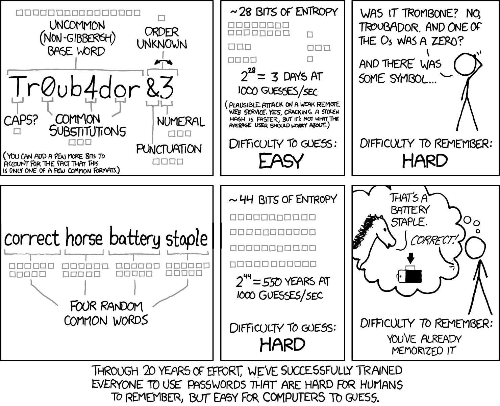

_In previous tutorials you've set up an AI assisted development environment, and created your first project. Now it's time to think about how to ensure you produce good code that's reliable. The good news is that the software development industry has done a lot of thinking about this..._

## Good practice

<table style="float: right; max-width: 33%; margin-left: 10px;">
<tr>
<td>


</td>
</tr>
<tr>
<td>

**Attribution:** <a href="https://www.vecteezy.com/free-vector/best-practice">Best Practice Vectors by Vecteezy</a>. This particular image by [Taufiq Anwar](https://www.vecteezy.com/members/taufiqanwar).

</td>
</tr>
</table>

**You have responsibilities.** When you write code for others to use, and before you commit to holding or processing data that's important to anyone else, you should be able to show that it will run correctly and handle data sensitively.

**Writing code that's easy to understand is an important step towards this.**

Unfortunately coding agents, following their vanilla behaviours alone, will often produce a lot more code than necessary, arranged in a jumble. When developers do this, it might be refered to as _messy_ or _spaghetti_ code. When AI produces it, we sometimes refer to it as _slop_.

> **⚠️ These terms can be used to bully others:** Calling someone's code messy, or accusing them of churning out slop, is a cheap way to deride and discourage someone[^slop].
>
> **I feel strongly about this:** Everybody is learning, and everybody has different levels of experience. Do better. Elevate others by offering kind advice. Make pull requests to help improve and describe why your changes will help. If you want people to do better, you should support them.
>
> It's also fair to say that long before AI entered the scene, developers took a view of how much effort to put into software development, and produced code of varying quality. Many factors affect this: deadlines, resources, experience, end user needs, other priorities...

This is problematic because:

- Code that's difficult to read is difficult to maintain and improve
- When it's difficult to do work, it costs many more tokens each time your coding assistant has to do anything
- Code that's difficult to understand is difficult to assure
  - How do you know it will protect your users' data?
  - How do you know it won't make mistakes?

> 💡 I've assembled a suite of guidelines, skills, and scripts that you can apply to any project. It'll support your coding assistant to make good decisions about the code it writes. It's deliberately built to complement small, inexpensive, agents with limited context (as well as larger, more capable agents).
>
> I've deliberately placed information about it towards the bottom of this post. I want you to read about, and understand, the problems it targets before making use of it.
>
> **I recommend you use a code quality tool, with every AI-assisted coding project.** You'll probably want to customise it to your needs once you're familiar with some of the premises in this post.

There are some key aspects to writing good code and, as a solo developer, a project lead, or working with an AI coding assistant, you can shape what's produced to be the best it can be:

- **Manage complexity** to make your code easy to understand and modify
- **Ensure reliability** to give assurances that your code does what you intended it to do
- **Follow good secure coding practices** to be compliant with data protection laws, and protect your users data

This post discusses complexity, and we'll cover reliability, testing, and security in subsequent posts.

### A quick word on security

Having said that, before we go any further, an important security guideline to protect yourself:

> **Never store live secrets, passwords, or keys in a public repository.** It may seem like the easiest way to get started, but you are putting those secrets at risk. There are attackers who regularly scan public repositories looking for keys they can use to spend your money, or access your services.

And while we're here - if you use a password to sign in to your repository provider, or your email, make sure it's a good password. If you can, turn on 2 factor authentication (2FA). This will help protect anything you store in private repositories, too.

> ⚠️ **Remember that your email address can often be used to reset a password.** An attacker with access to your inbox could respond to verification checks, copy authentication codes, approve password changes or hide them from you.

[This xkcd comic](https://xkcd.com/936/) explains how to pick a good password. There are plenty of good password generators available, including [correct horse battery staple](https://www.correcthorsebatterystaple.net/index.html), inspired by the comic. The NCSC (the UK's National Cyber Security Centre) also offers similar advice: [The logic behind three random words](https://www.ncsc.gov.uk/blog-post/the-logic-behind-three-random-words)



## Managing complexity

### The risk

> **Even if you're an experienced developer, and even if you're working on a small personal project, your code base is _probably_ going to grow past the point where a single person can know or remember everything about it.**

Developers and coding assistants must read and understand existing code to be able to write more code. A lot of this advice applies to code written by, and written for, people and machines alike.

Agents have limited context windows, even if they're running (expensive and) large models.

Everything a coding assistant needs to consider is a part of its context. As it reasons about your project, to understand what it needs to do next, this fills with data - which means each action it takes consumes more tokens and takes longer.

As the context grows near its limit, some assistants compact it - and each time they do, it degrades a little (reducing what they've learned to a summary).

It's important to make sure that code is sufficiently structured and clear to be able to work as efficiently as possible. Good documentation, following conventions, and structuring your project can help with the discovery of different parts of the code - reducing the reasoning needed to understand it.

> **For example:** In the previous tutorial, we added new functionality to the Streamlit application. It's _very likely_ that your coding assistant has placed all the code for that in the same file.
>
> **Look at it now:** It's probably _okay_ to read, because it's a simple project, so you can follow what it does with a little thought. There's plenty we can do to make it more readable, and more easily understood, though...
> 
> <details>
> <summary> <b>What my coding assistant produced...</b> </summary>
> 
> ```python
> import io
> 
> import pandas as pd
> import streamlit as st
> 
> st.title("My Little Data Prototype")
> st.write("Hello! This is a blank starter app.")
> 
> name = st.text_input("Enter your name")
> 
> if name:
>     st.write(f"Welcome, {name}!")
> 
> st.divider()
> 
> uploaded_file = st.file_uploader("Choose a CSV file", type=["csv"])
> upload = st.button("Upload")
> 
> if upload:
>     if uploaded_file is None:
>         st.error("No file selected. Please choose a CSV file first.")
>         st.session_state.pop("valid_df", None)
>     else:
>         try:
>             df = pd.read_csv(io.BytesIO(uploaded_file.getvalue()))
>         except Exception:
>             st.error("Could not read the file as CSV. Please check the file format.")
>             st.session_state.pop("valid_df", None)
>             st.stop()
> 
>         if not {"A", "B"}.issubset(df.columns):
>             missing = {"A", "B"} - set(df.columns)
>             st.error(f"The CSV file must contain columns A and B. Missing: {', '.join(sorted(missing))}")
>             st.session_state.pop("valid_df", None)
>             st.stop()
> 
>         rows = df[["A", "B"]]
>         errors = []
>         for index, (a, b) in rows.iterrows():
>             a_blank = pd.isna(a)
>             b_blank = pd.isna(b)
>             if a_blank and b_blank:
>                 continue
>             a_num = isinstance(a, (int, float)) and not isinstance(a, bool)
>             b_num = isinstance(b, (int, float)) and not isinstance(b, bool)
>             if not (a_num and b_num):
>                 errors.append(
>                     f"Row {index + 1}: invalid value(s) A={a!r}, B={b!r}. "
>                     "Each row must be blank or contain a number in both columns."
>                 )
>                 if len(errors) >= 10:
>                     errors.append("...and more")
>                     break
> 
>         if errors:
>             st.error("The file failed validation:")
>             for error in errors:
>                 st.error(error)
>             st.session_state.pop("valid_df", None)
>             st.stop()
> 
>         st.session_state["valid_df"] = df
>         st.success("File uploaded and validated successfully.")
>         st.dataframe(df)
> 
> if "valid_df" in st.session_state:
>     calculate = st.button("Calculate sums")
> 
>     if calculate:
>         try:
>             if uploaded_file is None:
>                 raise ValueError("The uploaded file is no longer available. Please upload it again.")
> 
>             df = pd.read_csv(io.BytesIO(uploaded_file.getvalue()))
>             c_values = []
>             for a, b in df[["A", "B"]].itertuples(index=False, name=None):
>                 if pd.isna(a) and pd.isna(b):
>                     c_values.append(pd.NA)
>                 else:
>                     c_values.append(a + b)
>             df["C"] = c_values
>         except Exception as exc:
>             st.error(f"The calculation failed: {exc}")
>             st.stop()
> 
>         count = int(df["C"].notna().sum())
>         st.write(f"Calculations: {count}")
>         st.table(df.head(10))
>         st.download_button(
>             "Download CSV",
>             df.to_csv(index=False).encode("utf-8"),
>             file_name="calculated.csv",
>             mime="text/csv",
>         )
> ```
> </details>

To make things easier, we can follow conventions, use standards, employ frameworks, and document our code.

**For anything larger than the small experiments in this tutorial, so far, it's a strong recommendation.**

### Breaking up your code

**Code is often broken up into functions that do one thing each.**  Function names are important to make it clear what they do. Functions can be kept in separate files, or grouped together in a single file, to make them easier to find.

When a function is used by another function, that makes it much clearer and easier to see what the code does. In turn, that makes it easier to maintain (with less time, effort, and tokens).

**Functions can be grouped, too.** Coding languages each offer their own ways to achieve this: classes, modules, and namespaces govern how code is arranged. Code files can be grouped into folders, often because they are interrelated, or are all a part of a single aspect of the project.

This is the beginning of thinking about the structure of your code base, and will help to make it accessible to others.

> There's a nice tool, called [aislop](https://github.com/scanaislop/aislop) that can measure and report on the signals that indicate spaghetti or sloppy code. It's a good way to spot disorganised code, or files and functions that are far too long for comfort.
>
> I've built aislop into my assembly of tools, which I'll discuss towards the end of this post.

### Common conventions

Let's take a look at some practices that help to make code easier to understand at a glance.

Software development is a discipline - and has developed some common ways of working that make it easier to work collaboratively.

- **Documentation:** By documenting the project, you and your assistant will have access to a useful summary of the code it has created.

  Documentation often lives in a folder called `docs/` in a repository. Keeping it _close_ to the code by keeping it in the repository makes it easy to discover.

- **Coding patterns:** By following common patterns and conventions you and other developers, including your coding assistant, can share a common language. You won't need to clarify so many things, and it'll have a much better clue about where to find the parts of the project it needs, and how to use them.

  See also: [Design Patterns](https://en.wikipedia.org/wiki/Design_Patterns)

- **Frameworks:** Some conventions and coding patterns are built into frameworks, which come with code you're bound to need, and can act like bumpers - helping your code follow an easily recognisable structure. This makes it easier to reuse, extend, or fix the things you create.

  Streamlit is one such framework, and it helps to build complex projects with user interfaces that are easy to maintain. (Other frameworks also offer this, in different ways. What's important is to have a logical, internally-consistent, approach so that the meaning of your code is predictable.)

- **Code quality constraints:** These are often rules to help developers write code that's easy to understand, or less likely to contain mistakes.

> These standards can be encoded as rules for your agents. Coding assistants can discover information about your project, including rules that specify how you want it to approach coding tasks, through an `AGENTS.md`[^claude] file and skills you write for your agents.

Here are a helpful subset of these guidelines:

1. DRY (Don't Repeat Yourself)
2. KISS (Keep It Simple Stupid)
3. YAGNI (You Ain't Gonna Need It)
4. SOLID (principles for object oriented development)
5. Separation of concerns (a precursor to the Single Responsibility Principle)

#### DRY (Don't Repeat Yourself)

**If you find that you've written the same function more than once, it's a candidate for deduplication.** In the ideal case, you'd only write it once, and call it from everywhere it's needed.

This is important because most of our assumptions, when we write code, will be challenged. It's very likely you'll need to change those functions. For every duplicate, that's an extra step - and another point in the code base you could forget about.

Some developers are more relaxed about this, and there's a case to say that if something _only_ appears _twice_, it _might_ be more effort to combine those instances than it's worth.

This is very much a judgement call - and something you'll want to tell your coding assistant about upfront, as you lay down coding standards.

> My personal approach is to err towards deduplication, even at two occurrences.
>
> As projects get bigger and more complex, you may not be able to remember where all the instances are, and so it becomes harder to keep every copy of every function consistent. To me, it feels better to nip it in the bud and combine them as soon as possible.
>
> Where it really would take too much time to reorganise or combine two instances of similar functions, I leave a comment at both locations, reminding me of the link between them.

#### KISS (Keep It Short and Simple)

KISS[^kiss] is nicely explained [here, at Geeks for Geeks](https://www.geeksforgeeks.org/software-engineering/kiss-principle-in-software-development/). It's a nice approach, and helps you to focus in on your core goals, avoiding distractions and helping to limit [feature creep](https://en.wikipedia.org/wiki/Feature_creep).

Product managers and delivery managers in larger teams will often do a lot of this thinking together with a lead developer.

I recommend spending time noting down what you need from each aspect of the project up-front. Make bullet points on what you want to achieve, and break the work down into individual features or individual cross-cutting aspects of the project.

This doesn't mean you need to assemble a full specification before you start, and _I definitely don't recommend a waterfall[^waterfall] approach_, but if you understand and acknowledge each part of the problem you want to solve, you can identify what's essential and what's nice-to-have in future.

So long as you track all the things you _intend_ to do, you'll be able to sift out, prioritise, and order the work to help keep control of the feature set. If you're working solo, this becomes even more essential to help you keep on track, and prevent the project from growing too large to maintain or complete.

There are plenty of ways to track units of work so you don't lose them. Examples include:

- [Jira](https://www.atlassian.com/software/jira) (Atlassian) - a popular, sophisticated, tool
- [Trello](https://trello.com/) (Atlassian) - a popular, simpler, tool
- [GitHub Projects](https://docs.github.com/en/issues/planning-and-tracking-with-projects/learning-about-projects/about-projects) (GitHub / Microsoft) - a nice tool, with the advantage that it's built into GitHub
- [Asana](https://asana.com/) (Asana) - a friendlier tool

There are plenty of others.

For simple projects, keeping a small spreadsheet or list of tasks could be sufficient to get started. Be prepared to migrate between tools if things get complex or difficult to follow. I don't advise leaving full control of the project to your coding assistant. It's your project and you're responsible for the outcomes, so keep hold of the reins.

#### YAGNI (You Ain't Gonna Need It)

It's tempting to write a lot more code than you need to achieve your immediate goal. Many developers think ahead to how they will accommodate future needs, which is good - but requirements frequently change.

> **We tend to think of requirements as unchanging.** We're wrong about that, _surprisingly often._

Building features you don't need is expensive: You'll spend time building it, sure, but you may also need to spend time unpicking it if it turns out to conflict with a new requirement.

That doesn't mean build the bare minimum (although that would be efficient) - because you'll end up paying extra time if you're not forward compatible.

Find a balance between _what's needed now_ and _what would make it easier to extend the project in future_.

> There's a nice tool, called [ponytail](https://ponytail.dev/)[^ponytail], which can help your coding assistant rationalise the code it writes. It's a good step towards this - although you may need to intervene at times to ensure it does retain future compatibility.
>
> I've built ponytail into my toolset, which I'll discuss towards the end of this post.

#### SOLID

**SOLID is a set of principles for object oriented software development.** It's particularly targeted at languages that support OOP[^oop] but there are aspects of these principles that apply to all styles of coding.

We won't go into this in depth, but I've summarised it below. It's worth knowing about should you find yourself working on a larger, or more complex, object oriented project.

<details>
<summary> <b>SOLID principles...</b> </summary>

These principles help keep code flexible and more easily maintainable:

1. **Single responsibility principle** - each class should have one responsibility
2. **Open–closed principle** - build a class so that new features can be added by extending it, without modifying it
3. **Liskov substitution principle** - if you extend a class, anything that uses the base class should be able to use the extension
4. **Interface segregation principle** - code should not be forced to depend on an interface it doesn't use
5. **Dependency inversion principle** - code should depend on abstractions (like interfaces) rather than concrete classes

NB. These principles can lead to a lot of code that takes a long time to write. Once it's written, the benefits are manifest but, in some cases, small projects with limited resources and limited scope may pick and choose what's best to achieve their goals.

See also: https://en.wikipedia.org/wiki/SOLID

</details>

#### Separation of concerns

Well-established long before the SOLID principles above, this is a good guideline for working in any language - and it covers a lot of what we talked about in the **Managing complexity** section near the beginning of this post.

**Whether it's a function, class, or module, each distinct unit of code should have a single, clear, responsibility.**

This makes sense intuitively - it means you can more easily understand the purpose of what you're looking at and, it should quickly become clear where you need to make a change when you're modifying a feature. This helps developers and coding agents alike.

## How to apply coding standards

These principles, once internalised, will help you to become a great coder. They play a part in the consideration of quality for every software development project - and can often make the difference between accepting code or asking for revisions.

### `AGENTS.md`

You can embed those principles in the work your coding assistant does by giving it directives in a file called `AGENTS.md` (or, for Claude Code, `CLAUDE.md`).

You could, for instance, lay down a series of rules that guide it towards making good decisions, based on the commentary above. I'd suggest that you summarise the rules you want into clear, bullet-point, rules that agents can easily follow.

### Skills

Coding assistants also support skills, which are a set of steps (and supporting resources) you can provide.

These can be stored in the repository (for skills relating to the project) or elsewhere on your system (for more universal skills). They often take the form of a markdown document (suffix `.md`) that contains a list of steps for the agent.

Most coding assistants also have a skill creation skill that you can invoke by asking to create a new skill (and describing what it should do). That skill creation skill should walk yoy through the process of designing the skill, clarifying anything ambiguous, and writing it into the right place so it's easy for the agent to discover.

### `dev-qual`

I have assembled these rules, along with a number of additional skills and tools that agents can use when developing code to keep quality high, and to assess quality throughout the process.

It's called `dev-qual`, and it's available at: 
- https://github.com/instantiator/dev-qual

`dev-qual` includes a lot of advice for your agent, including coding standards for several common programming languages and frameworks. It also offers common conventions, and makes requirements around quality assurance gates. It also builds several skills and tools into your repository that your agent can use.

#### Installing `dev-qual`

1. Add `dev-qual` as a git sub-module[^gsm] in your repository.

   ```bash
   git submodule add https://github.com/instantiator/dev-qual.git
   ```

2. Run the installation script, which will guide you through the process of building these quality controls into your repository.

   ```bash
   dev-qual/install.sh
   ```

> NB. The standards in `dev-qual` include requirements around testing that we'll discuss in an upcoming post.

Two third-party tools that `dev-qual` installs, that are worth a mention:

| Tool | Description | License |
|-|-|-|
| [aislop](https://github.com/scanaislop/aislop) | Catch the slop AI coding agents leave in your code: narrative comments, swallowed exceptions, as-any casts, dead code, oversized functions. 50+ rules across 8 languages. | [MIT](https://github.com/scanaislop/aislop?tab=MIT-1-ov-file) |
| [ponytail](https://github.com/DietrichGebert/ponytail) | Makes your AI agent think like the laziest senior dev in the room. The best code is the code you never wrote. | [MIT](https://github.com/DietrichGebert/ponytail?tab=MIT-1-ov-file) |

Both offer excellent and complementary quality assurances.

## Summary

> ℹ️ I let **Big Pickle** summarise this post. I tweaked it a little...

This post has been about producing code that's reliable, readable, and easy to maintain — even when a coding assistant is doing the writing.

We covered the key guidelines for managing complexity:

- **Break your code up** into small functions that do one thing each, grouped sensibly across files and folders.
- **Follow common conventions** — document your project, use established patterns, lean on frameworks, and set quality constraints.
- **Apply principles** - DRY, KISS, YAGNI, and separation of concerns.

We also covered security essentials worth doing now: **never store secrets in a public repository**, and **use strong passwords with 2FA.**

Finally, we saw how to put this into practice automatically — encoding your standards in `AGENTS.md` and skills, or adopting a ready-made assembly like `dev-qual` (with aislop and ponytail included).

**The bottom line:** as your projects grow, no one can hold the whole thing in their head. Making your code easy to understand is the cheapest investment you can make — and it pays off every time you or your assistant change something.

Next, we'll look at **reliability and testing** — how to give real assurances that your code does what you intended.

[^slop]: I've used _slop_ in the title of this post - mainly to draw attention to it. It's a common term, and reasonable for us to talk about it - but I'd still rather not turn it on someone as a criticism of their work.

[^claude]: Use `CLAUDE.md` if you're using Claude Code (instead of opencode). Anthropic are the notable holdout on `AGENTS.md` - everyone else has found a way to collaborate on this, as it's a simple standard.

[^kiss]: KISS is also known as "Keep it simple, stupid!", but I think that's rude.

[^waterfall]: The [waterfall](https://en.wikipedia.org/wiki/Waterfall_model) model of software development is an approach developed before modern techniques (such as agile or lean) were devised. It mandates a full specification of the project to be delivered first, which is then developed (in full), and tested (in full). The aim was to ensure quality through adherence to a specification. It falls down because this is a misunderstanding of quality. Requirements change constantly during software development, and specifications documents are unable to capture the nuance of real user needs. Without continuous customer and user involvement during software development, the finished product is rarely what the user expected, wanted, or needs. It offers no intervention points where effort can be redirected, or the outputs improved - which ultimately creates an unsatisfactory product (and potentially some expensive rewrites).

[^ponytail]: The (amusing) description of ponytail does seem to put slightly too much focus on the physical appearance and gender of an experienced senior developer. I've taken that with a pinch of salt. The tool itself is good.

[^oop]: [Object Oriented Programming](https://en.wikipedia.org/wiki/Object-oriented_programming) (OOP) is a programming approach built around objects. An object is a collection of functions and variables that can be thought of as a separate entity inside the program. These are often made from classes (which serve as templates), but each programming language has its own variants and approaches to this. Most programming languages support this to some degree, and many are built with this concept at their core. It's a great way to manage resources, especially when building complex software.

[^gsm]: Git sub-modules exist in your repository as a directory, but they're treated as their own repository, and all that's tracked is the _version_ they're at.