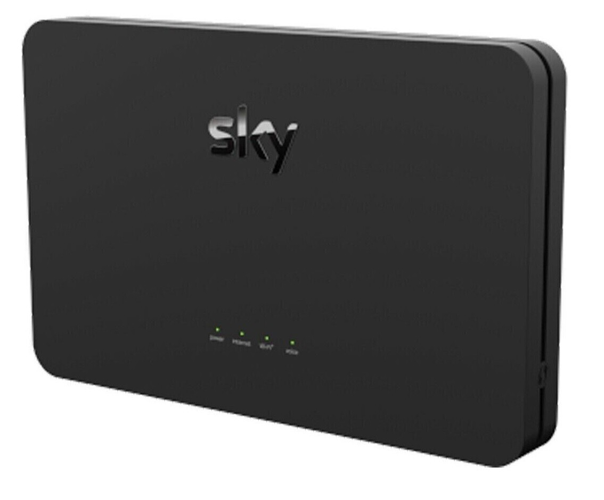
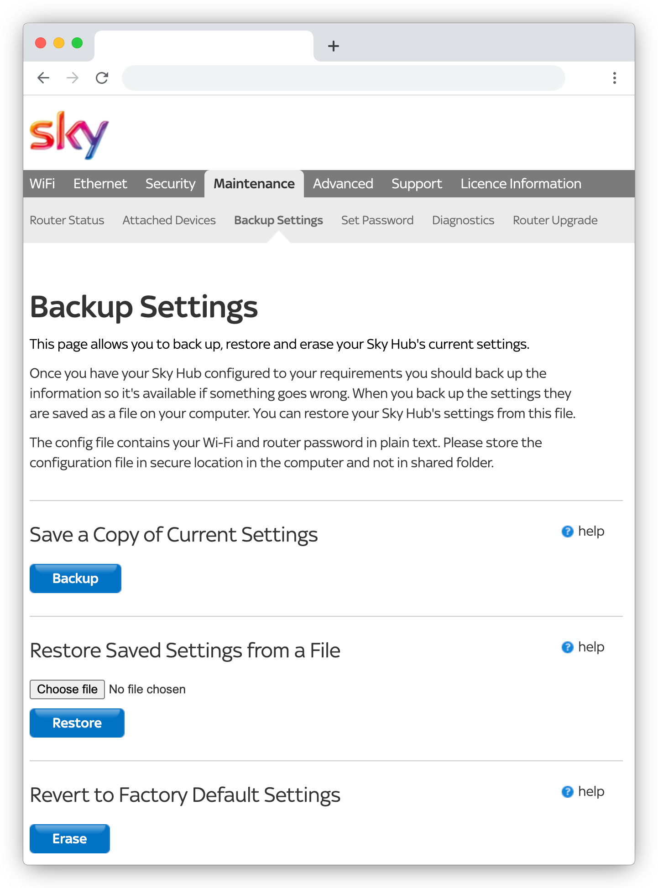

_There's a bug in the Sky Hub that stops you from changing a whole bunch of settings. It's a genuine mistake that Sky won't fix. Here are some workarounds to help you control your home network..._

## Sky Hub blues

The `SR203` Sky Hub has a problem. On the latest firmware[^firmware], a bug prevents you from from changing several key parts of the configuration...

| Sky's `SR203` Hub | Some cartoon Gemini cooked up |
|-|-|
|  |  |

I'm using DDNS (dynamic DNS) to remotely communicate with some services that I host at home. To do that, I need to be able to forward internet traffic that arrives at certain ports, and to give some of the devices on my home network (a couple of Raspberry Pis) fixed IP addresses. This is all _possible_ but the Sky Hub's poor interface has bugs that get in the way.

[^firmware]: 2026-07-29: The latest firmware version at time of writing is: `7.04.0207.R`

**💀 It seems like this is a long-standing known issue, and that Sky aren't likely to fix it any time soon.**

### The symptoms

It's worth noting that this really only occurs over wifi.

Instead of allowing yoy to change a configuration value, the Hub reloads the page and shows an warning that says "your session has expired". (The session hasn't _actually_ expired, and this always occurs.)

Experimentally I've spotted problems with:

- Managing the wifi networks (changing SSID, splitting 2.4 and 5 GHz bands)
- Setting up port forwarding
- Reserving IP addresses

I'm sure there are other issues. It seems to relate to creating or modifying objects in the configuration.

<div style="max-width: 50vw; float: right; margin-left: 10px;">

</div>

## Workarounds

So what can we do about it?

### A. Use an ethernet cable

This was, surprisingly, the simplest solution (and the one that took me the longest to discover). A degree of searching led to the suggestion that _perhaps_ this was something worth trying - but it felt like a last resort...

In the end, I dug out a USB-C to USB-A adapter, the old Belkin gigabit USB 2.0 ethernet adapter, and an old ethernet cable. Amazingly, it worked! Over a wired connection, the hub's web interface stops giving false session timeouts, and allows you to modify the configuration.

- Turn off your wifi
- Connect an ethernet cable between your laptop and the hub
- Visit the hub at: [http://192.168.0.1](http://192.168.0.1)

Read on if you don't have a laptop with an ethernet port you can use, or if you don't have access to the fiddly little ancient adapters I keep in a box 'for a rainy day'...

### B. Backup and restore

This is the software solution. It's a bit more fiddly, but it'll work over wifi. Here's the workaround:

You can backup your hub configuration through the web UI, and you can restore it from a backup. This solution involes editing the configuration and then re-uploading it.

This also works - and it's less risky than it sounds. If your hub doesn't recognise something in the configuration file it'll either reject your upload (because it doesn't think it's valid), or it'll simply ignore the change.

## Sky Hub configuration files

Sky's `SR203` hub's configuration files are in XML format, but they're not well documented.

Although it has areas of compatiblity with the ([Broadband Forum TR-098](https://www.broadband-forum.org/pdfs/tr-098-1-2-1.pdf)) standard, the hub only loosely follows it. There's no other publicly available documentation around the format of the configuration file, and it's a proprietary product - so there's not much incentive to do so.

There are XML elements in the TR-098 standard that look as if they might be usable to configure the hub - but they aren't actually used[^unused].

[^unused]: Examples of unused XML elements: `WANIPConnection.PortMapping`, `LANHostConfigManagement.DHCPStaticAddress` - both of which would have been very handy if they were in use!

[^inference]: I used `trang`, a tool by James Clark that can infer a schema from XML samples. It's part of the `jing-trang` package (`brew install jing-trang`).

### Inferred schema

In the absence of reliable documentation, I've inferred[^inference] an XML schema using variations of my own configuration, which you can use to validate changes before you apply them.

- **[`sky-sr203-inferred.xsd`](./sky-sr203-inferred.xsd)**

## Changing the hub configuration

Here's the proecss to making an edit:

1. Download the current config from the hub
2. Edit it to add what you want (a reservation, a port forward)
3. Validate your modified XML before you upload
4. Upload it back into the hub
5. Download it again afterwards and check your change was accepted

> 💡 That last step is important: If the hub doesn't recognise a part of the configuration, it can silently ignore it. When it does that, it won't appear in the download so you can spot things that didn't work.

Some things to know:

- **You can't include XML comments.** (eg. `<!-- comment -->`) These will fail the upload.
- **The order of siblings matters.** You must put elements in the same order that the hub expects to find them.

### 1. Download the current config

Your hub's web interface has a way to download (backup) the current configuration:

<table>
<tr><th>Steps</th><th>Screenshot</th></tr>
<tr>
<td>

Visit your hub's **Maintenance** - **Backup Settings** section.

This is usually at: [http://192.168.0.1/sky_backup_settings.html](http://192.168.0.1/sky_backup_settings.html)

You should see buttons to allow you to save a copy of the current settings, restore settings from a saved copy, and reset back to factory settings.

Click the **Backup** button to download a copy of your configuration.

</td>
<td>



</td>
</tr>
</table>

### 2. Setting up port forwarding

Port forwards live in a flat, proprietary object called `SKY_GENERIC_WAN_FIREWALL_EXCEPTION`.

- It must be a direct child of `InternetGatewayDevice`[^pf-nesting] in the XML.

[^pf-nesting]: Don't nest it inside `WANDevice` or `WANIPConnection` (the as the TR-098 standard would imply).

Find the existing list (which could be empty). It should end with a self-closing `nextInstance` placeholder:

```xml
<SKY_GENERIC_WAN_FIREWALL_EXCEPTION nextInstance="1"></SKY_GENERIC_WAN_FIREWALL_EXCEPTION>
```

Replace anything there with your new rule(s), followed by an updated placeholder:

```xml
<SKY_GENERIC_WAN_FIREWALL_EXCEPTION instance="1">
  <Enable>TRUE</Enable>
  <FilterName>my-web-server</FilterName>
  <Protocol>TCP</Protocol>
  <SourcePortStart>1</SourcePortStart>
  <SourcePortEnd>65535</SourcePortEnd>
  <DestinationPortStart>443</DestinationPortStart>
  <DestinationIPAddress>192.168.0.50</DestinationIPAddress>
  <BlockAction>allow_always</BlockAction>
</SKY_GENERIC_WAN_FIREWALL_EXCEPTION>
<SKY_GENERIC_WAN_FIREWALL_EXCEPTION nextInstance="2"></SKY_GENERIC_WAN_FIREWALL_EXCEPTION>
```

| Element | Notes |
|-|-|
| `FilterName` | This is just a label (shown in the web interface). |
| `SourcePortStart` / `SourcePortEnd` | These indicate the range of ports on the _remote_ machine that are allowed to _initiate_ a connection. (Leave as `1`-`65535`, meaning: it doesn't matter which port is used by the remote machine. This is normal.) |
| `DestinationPortStart` | This is the port being opened on your hub. |
| `DestinationIPAddress` | This is the IP address of the internal device the traffic gets sent to. |

> Unlike most lists in this config format, there's no `...NumberOfEntries` counter for this object — just the numbered `instance="N"` entries and the trailing `nextInstance` placeholder.

- Add one block per service.
- Increment `instance` for each block.
- Bump the final element's `nextInstance` to the next unused `instance` number.

> NB. There's no separate field for the internal port, and there's no support for translating one external port to a different internal port. External and internal ports are always the same number. The hub is effectively 'exposing' an internal port on its external interface.

### 2. Reserving IP addresses

Port forwarding relies on being able to send internet traffic on to a known IP address, so it's a good idea to give the device you're forwarding to a fixed address.

Reservations live in an element called `DHCPConditionalServingPool`, which must be nested inside `LANHostConfigManagement` (itself inside `LANDevice`), and placed after the
existing `IPInterface` entries:

```xml
<LANHostConfigManagement>
  <DHCPServerEnable>TRUE</DHCPServerEnable>
  <IPInterfaceNumberOfEntries>1</IPInterfaceNumberOfEntries>
  <IPInterface instance="1">
    ...
  </IPInterface>
  <IPInterface nextInstance="2"></IPInterface>
```

Reservations go here:

```xml
  <DHCPConditionalServingPool instance="1">
    <Enable>TRUE</Enable>
    <Chaddr>aa:bb:cc:dd:ee:ff</Chaddr>
    <ReservedAddresses>192.168.0.50</ReservedAddresses>
    <DomainName>my-web-server</DomainName>
  </DHCPConditionalServingPool>
  <DHCPConditionalServingPool nextInstance="2"></DHCPConditionalServingPool>
</LANHostConfigManagement>
```

| Element | Notes |
|-|-|
| `Chaddr` | This is the device's MAC address, lowercase, colon-separated. |
| `ReservedAddresses`[^not-yiaddr] | This is the IP to assign. |
| `DomainName` | This is just a label (shows as the device's name in the UI). It doesn't need to match the device's real hostname. |

> As with port forwards, there's no `NumberOfEntries` counter. Each entry has an `instance="N"` property, and a trailing `nextInstance` placeholder.

[^not-yiaddr]: NB. This is *not* called `Yiaddr`, even though that's what the TR-098/TR-181 standard suggests. This object is specific to Sky.

- Add one block per service.
- Increment `instance` for each block.
- Bump the final element's `nextInstance` to the next unused `instance` number.

### 3. Validate your XML

First, download the schema to the same folder as the config file you're working on. I inferred a schema using `trang`, a mature tool, by James Clark, that can infer a schema from XML samples.

- **[`sky-sr203-inferred.xsd`](./sky-sr203-inferred.xsd)**

`xmllint` ships with Mac OS. (It's a part of `libxml2`, and you don't need to install anything.)

To check a config file against the donwloaded schema:

```sh
cd path/to/your/working/folder
xmllint --noout --schema sky-sr203-inferred.xsd your-config-file.conf
```

**No output means your config file has validated against the schema.** Any error printed by the tool will point to the line, and element, that doesn't match[^not-necessarily-wrong].

[^not-necessarily-wrong]: This doesn't actually the config is _necessarily_ wrong, but it's a strong hint. Remember, the schema is only _inferred_ and to do that I used a few variants of my own config. It _should_ be correct, but mistakes might slip in.

> There's also a Visual Studio Code extension you can use to see schema warnings while you edit a file:
>
> - [XML extension by Red Hat](https://marketplace.visualstudio.com/items?itemName=redhat.vscode-xml)
>
> Add a file association in your _workspace_ `.vscode/settings.json` to force it to use the schema for `.conf` files:
> 
> ```json
> {
>   "xml.fileAssociations": [
>     {
>       "systemId": "./sky-sr203-inferred.xsd",
>       "pattern": "**/*.conf"
>     }
>   ]
> }
> ```
>
> (Restart Visual Studio Code after modifying the settings.)

### 4. Upload your new configuration

<table>
<tr><th>Steps</th><th>Screenshot</th></tr>
<tr>
<td>

Visit your hub's **Maintenance** - **Backup Settings** section again.

- [http://192.168.0.1/sky_backup_settings.html](http://192.168.0.1/sky_backup_settings.html)

- Use the file picker to select your new configuration file.
- Click the **Restore** button to download a copy of your configuration.

</td>
<td>


</td>
</tr>
</table>

The hub will reboot, and you'll spend a few minutes waiting while it loads the new configuration and your laptop reconnects.

Once reconnected, either the new configuration will have been accepted, or it will have been silently dropped.

### 5. Download and check the latest config

Visit your hub's **Maintenance** - **Backup Settings** section one last time, and download one more copy of the configuration.

If all's well, your new changes will be visible in the file. You should also be able to see those changes in the hub's web interface (even if you still can't edit them there).

If something wasn't recognised (perhaps you made a typo or missed an instruction above), they'll have been removed.

If that's the case, check the XML you first prepared, fix any issues, and try again. If it's still not working then, I'm afraid, we've reached the end of the road. I suggest asking a friend or colleague if they can help you connect to your hub by ethernet cable.

**Good luck!**

## References

- [Cannot change any setting on sky router](https://helpforum.sky.com/t5/Broadband/Cannot-change-any-setting-on-sky-router/td-p/3837186)
- [Setting up Port Forward on Sky SR203 router](https://helpforum.sky.com/t5/Broadband/Setting-up-Port-Forward-on-Sky-SR203-router/td-p/4643786)
- [Fixed IP Address (or sometimes called Reserve IP Address)](https://helpforum.sky.com/t5/Broadband/Fixed-IP-Address-or-sometimes-called-Reserve-IP-Address/td-p/4747344)