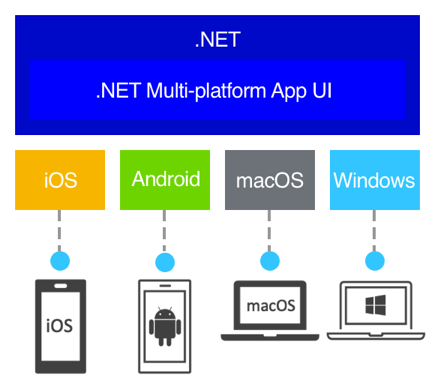

_A short guide to picking a development language._

<table style="max-width: 50%; float: right; margin-left: 10px;">
<tr><td>

</td><tr>
<tr><td>

Anyone can code.

</td></tr>
</table>

> Updated: 2026-08-10

# Picking a language

This is a short exploration of the choices for coding beginners.

There's no reason to believe that your gender, age, or any other characteristic should hold you back from learning to code. Anyone who tells you differently is gatekeeping, and that's not kind. If you want to get started, read on...

Choosing a language or framework to learn might seem daunting, but hopefully this will help.

Communities form around frameworks and languages, and those communities build libraries you can use in your projects, generate lots of self-help material (such as this blog), support each other and improve the tools available to you as a developer.

It's because of these communities that the creators of the tools you're using will continue to support and develop them.

There are plenty of coding courses that will teach you these things for free, and plenty of resources online. The goal here is to talk about what to look for, and to help you make a choice about what to invest your time in.

Whatever you build, it's worth understanding how best to build an inclusive experience for all users. The UK's [Government Digital Service](https://accessibility.blog.gov.uk/) run an accessibility blog, which is a great place to learn more about it.

> **Disclaimer:** Any languages ought to support everything you need to do, and technically, they all can. However, they each have different libraries, and some are more commonly used to build certain kinds of application than others.

You probably don't want to write a web server from scratch just to host a website. An informed approach will help you choose the right tool for the job.

I originally wrote this article in 2021. Since then, I've updated it several times, and it'll continue to evolve...

## Think like a coder

If you're at the absolute beginning of your learning journey, and you want to start experimenting with code,I'd suggest [Scratch](https://scratch.mit.edu/). It's a highly visual tool, designed to teach coding.

When you feel ready to write some code, you could move on to [Python](https://www.python.org/). It's everywhere, right now, and steadily increasing in popularity. It's got a great community and lots of libraries that let you set up simple web servers, through to complex data science and machine learning.

The basics of Python are likely to underpin quite a lot of whatever you decide to do next, if you decide to keep learning.

## Frameworks

Picking a language to get comfortable with is a good start, but there are also frameworks to choose from. Each framework is a library of code that does a lot of the heavy lifting for you - so you can focus on what matters (the real content or behaviours of your new application).

## Simple websites

Websites are built with code, too, and even if you're going to use graphical tools to build them, understanding how they work will help you improve your craft.

Websites are broadly split into two types:

- Static websites
- Interactive web applications

Static websites are much simpler to build and host than full web applications. Typically these are built with static site building tools. These often allow you to write your content in HTML or Markdown (`.md` files), and require only a small learning curve to get started.

If you're interested in creating webpages yourself from code, this will give you a lot more control over the page. There are plenty of places to start, but I'd recommend that you pick up the basics of [HTML](https://www.w3schools.com/), [CSS](https://www.w3schools.com/css/) and [Javascript](https://www.w3schools.com/js/default.asp)[^js].

[^js]: Javascript - not to be confused with Java. They're very different languages.

> NB. TypeScript is a lot like Javascript, but it's a typed language. That means it has features that can protect you from some common pitfalls. My updated advice here is to learn TypeScript in preference to Javascript. There's a bit more to learn conceptually, but you will spend less time scratching your head and debugging!

Before you go too far with hosting options, it's worth trying out what you've got. Now is a good time to pick up some [git](https://git-scm.com/) (a tool for managing code and code repositories) and then pop your website on something like [GitHub Pages](https://pages.github.com/) to test it out.

### Web application frameworks

There are a variety of frameworks for common languages that are used to develop web apps. Here are some popular choices:

| Language | Framework | Notes |
|-|-|-|
| Typescript | React | This is a popular framework for web application front-ends. |
| Typescript | Vue | This is a popular framework for web application front-ends. |
| Typescript | NextJS | A framework that covers both backend and frontend. |
| Typescript | NestJS | A popular web application backend, following the MVC pattern. |
| Typescript | ExpressJS | A very minimalist web application backend framework. |
| Python | Flask | This is a popular backend framework. |
| C# | ASP.NET Core | A popular backend framework for .NET developers. |

There are plenty of others, and I recommend you take a good look around or consult a colleague before you commit. It's often hard to unpick a framework and select another.

It's worth understanding where you will host your application, too. Interactive backends will need to be hosted somewhere they can run.

## Mobile apps

Mobile development is very fast moving. At the current time I could make a number of different recommendations, depending on what you are planning to build for (usually a choice between Android, iOS, or both).

For each platform, there's not just a good language, but also a framework of built-in libraries and conventions to learn about. I'd recommend finding yourself a good, recently updated, course or tutorial to ensure you get to know all the intricacies.

If you're building for iOS (iPhones and iPads) exclusively, consider learning [Swift](https://developer.apple.com/swift/). It has replaced Objective C as the language of choice. Apple provide an IDE called [XCode](https://developer.apple.com/xcode/) for this.

Similarly, for Android phones, [Kotlin](https://kotlinlang.org/) is the language of choice (having replaced Java as the first-class language on Android). Google provide [Android Studio](https://developer.android.com/studio), which supports Java and Kotlin in Android projects.

If you'd like to build for both Android and iOS at the same time, you might consider picking up [C#](https://docs.microsoft.com/en-us/dotnet/csharp/) and the ~~[Xamarin](https://dotnet.microsoft.com/apps/xamarin)~~ [.NET MAUI](https://learn.microsoft.com/en-us/dotnet/maui/what-is-maui?view=net-maui-10.0) framework.

This has the advantage that you only need to write your code once, and the Xamarin.Forms framework helps you to design your user experience in such a way that it will work across both platforms.

Alternatively, you could look at building your app in web technologies - giving you the advantage of working on any mobile platform and regular web browsers too. There are some great frameworks for that, and it's all underpinned by HTML5 and Javascript. I'd recommend reading about [Progressive Web Apps](https://developer.mozilla.org/en-US/docs/Web/Progressive_web_apps) to understand exactly which hoops you'll need to jump through to build a PWA.

NB. Support for PWA features has improved recently. Apple were notorious for dragging their feet with feature implementation. Things have improved now. eg. iOS didn't
support web push notifications for years. It was recently implemented.

## Games

[Unity](https://unity.com/) was once an undisputed champion of indie game developers. Some unexpected decisions relating to licensing and costs have discredited it a little. Open source frameworks, like [Godot](https://godotengine.org/), are now a much better bet for those starting out. There are many tutorials and courses you can follow to get started.

For a lot of game development, you'll be designing and arranging levels and graphics. Eventually, though, you'll want to encode some behaviours for the things in your game.

Other game development frameworks exist, too - and you may find you like the look of a simple javascript, web based game development environment more. There are quite a few well loved libraries for that (such as [impact](https://impactjs.com/) or [phaser](http://phaser.io/)).

There are plenty of other, more sophisticated games engines you could use too - and those may involve C++ or even C. These languages will give your code a real speed boost as they compile to code that runs directly on your computer's processor, with far fewer layers of abstraction. They're also pretty complex, but if you're considering a future in game development, this may well be time well invested.

# Enterprise

This isn't the most thorough analysis of enterprise technologies, but if you're looking to work for business and industry, there are plenty of jobs available
working on systems that need to behave predictably and reliably. They'll be talking to databases, storing, validating and processing user input, generating reports, and controlling other systems. A small number of mature languages with well established frameworks are common, here. The front-runners are: Java and C#

[Java](https://www.java.com/en/) (currently owned and supported by Oracle) is a bit long in the tooth now, but it's very well supported, still has a huge community and still in use across great swathes of industry.

[C#](https://docs.microsoft.com/en-us/dotnet/csharp/), by comparison, feels like a slightly fresher and more intuitive take on a similar set of ideas to Java. Where Java is sometimes a little verbose, C# has found ways to make life a little easier, and tooling such as Visual Studio do wonders for usability.

Both of these languages have strong support for features that help to reduce the errors you make, such as testing, strong typing, and logging. Both also have well established frameworks that can help you to build robust websites, and web services. In Java, it's worth taking a look at [Spring Boot](https://spring.io/projects/spring-boot), or [DropWizard](https://www.dropwizard.io/en/latest/). C# offers [ASP .Net Core MVC](https://docs.microsoft.com/en-us/aspnet/core/mvc/overview).

There are plenty of other libraries and frameworks that offer similar capabilities. It's a good idea to assess what's available at the beginning of each project.

# Data

There are two main types of database in the world - SQL and NoSQL.

[SQL](https://www.w3schools.com/sql/) is a language for querying data in relational databases (here, data is stored in tables. Each table describes a single type of record, just like rows in a spreadsheet. Relationships are defined between the tables so that records in one table can refer to others). Databases such as [MySQL](https://www.mysql.com/), [MSSQL](https://www.microsoft.com/en-gb/sql-server/sql-server-2019) (aka SQL Server, from Microsoft), [SQLite](https://www.sqlite.org/index.html) and [postgres](https://www.postgresql.org/) are SQL databases.

You're likely to need a bit of an understanding of SQL whatever the nature of the data you're working with. It's everywhere.

NoSQL databases (aka documenting databases) store data as 'documents'. You can think of a document like an individual file, containing a single record. These are arranged into collections. Depending on the choice of NoSQL database you're using you may need to understand a little about data formats such as [JSON](https://www.w3schools.com/js/js_json_intro.asp) and [YAML](https://en.wikipedia.org/wiki/YAML). [MongoDB](https://www.mongodb.com) and [redis](https://redis.io/) are examples of documenting databases.

[XML](https://en.wikipedia.org/wiki/XML) used to be all the rage for representing data like this. You'll find that most new systems prefer JSON and YAML though, as they are much more concise and a little easier for people to read and write.

# Microservices

A microservice is a small, well-defined application that does a few things well. They run inside an environment called a container. Containers are a fun idea. They're a small, lightweight virtual machine (usually a Docker container, and usually a bit linux-like).

You get some guarantees from running your code inside a container, such as:

- You can control the versions of everything inside the machine. (This helps to prevent accidental upgrades that affect the behaviour of your code, or introduce breaking changes.)
- If the container runs on your machine, it'll run everywhere.

There are plenty of pre-built Docker containers to choose from to build your service. Many of which are full applications in the own right, others are environments for running your code in.

Interestingly, although I didn't list Python amongst the languages for enterprise software development, it's well suited to building microservices. You can create small services quickly and test them thoroughly to ensure they do what you need. The [python container images](https://hub.docker.com/_/python) at Docker Hub
have instructions for getting started.

When you've a few different microservices you'd like to run together, I suggest experimenting with Docker Compose. It allows you to define groups of Docker containers that run together, and communicate with each other in a miniature virtual network of their own.

Docker containers are the basic unit of a number of bigger frameworks such as [Cloudfoundry](https://www.cloudfoundry.org/) and [Kubernetes](https://kubernetes.io/).

These frameworks are often used in enterprise environments to ensure that code is running reliably, and they make guarantees of their own, like:

- Your container will always be running, and automatically restarted if it fails.
- You can build groups of the same container, so that there are always 3 of them running (for example).
- You can have fine-grained control of which containers can communicate and how.
